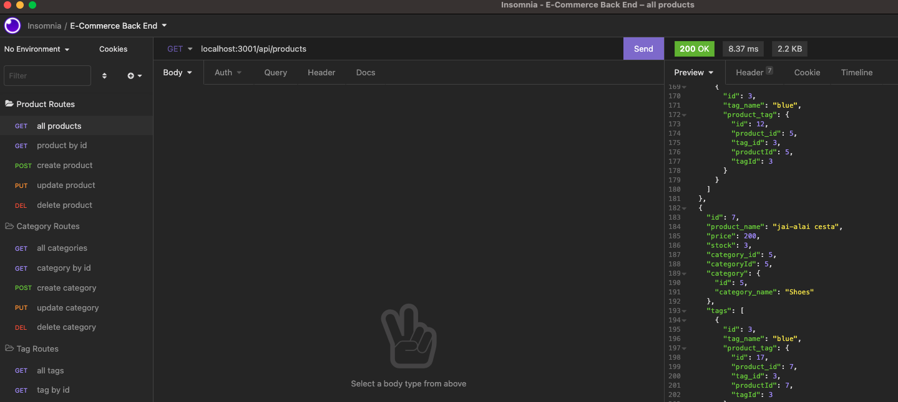

# E-Commerce Back End using ORM
  ##  
   
  ## Licensing:
  
  ## Table of Contents: 
  - [Description](#description)
  - [Technology](#technology)
  - [Installation](#installation)
  - [Usage](#usage)
  - [Questions](#questions)

  ## Description:
  In this project I used the ORM Sequelize to manage routes for an e-commerce app written with Express.js.   
  ## Technology:
  JS, Sequelize, MySQL, Insomnia
  ## Installation: 
  Navigate to the root of the directory.  Run npm install and start the app in the integrated terminal with the start script npm start. Then open a separate terminal for mySQL.  In this terminal type mySQL -u root -p.  Then type in your MySQL password.  It will not appear. Now you are ready to open your routes in Insomnia.  Test GET, POST, PUT, and DELETE routes for the Product, Tag, and Category models. 
  ## Usage: 
GIVEN a functional Express.js API 
WHEN I add my database name, MySQL username, and MySQL password to an environment variable file
THEN I am able to connect to a database using Sequelize
WHEN I enter schema and seed commands
THEN a development database is created and is seeded with test data
WHEN I enter the command to invoke the application
THEN my server is started and the Sequelize models are synced to the MySQL database
WHEN I open API GET routes in Insomnia for categories, products, or tags
THEN the data for each of these routes is displayed in a formatted JSON
WHEN I test API POST, PUT, and DELETE routes in Insomnia
THEN I am able to successfully create, update, and delete data in my database
  ## License: 
  None Provided 
  ## Questions: 
  lmc@uga.edu
  
  <https://github.com/tripledawg>